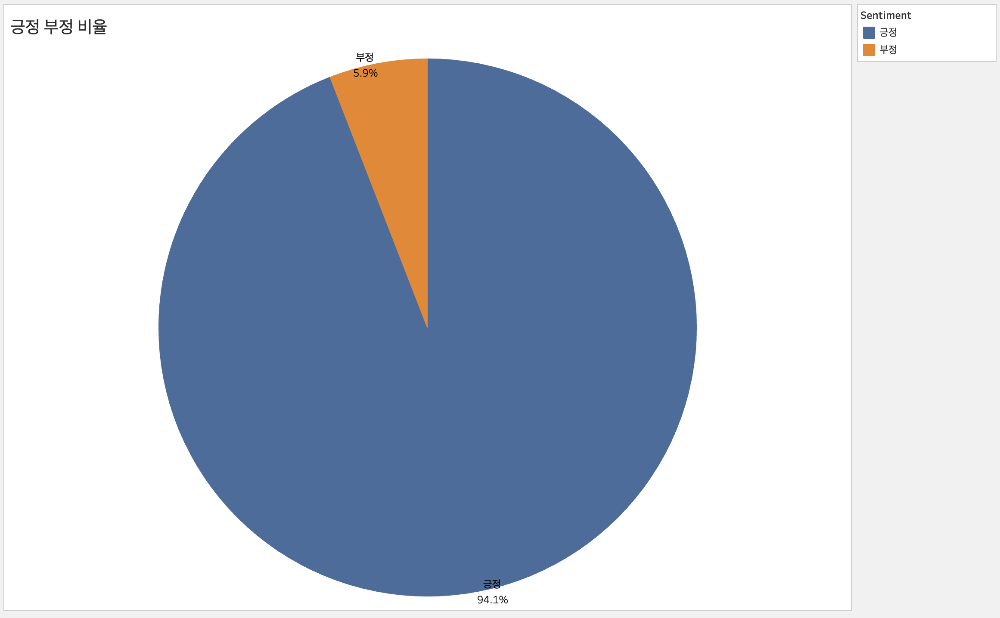
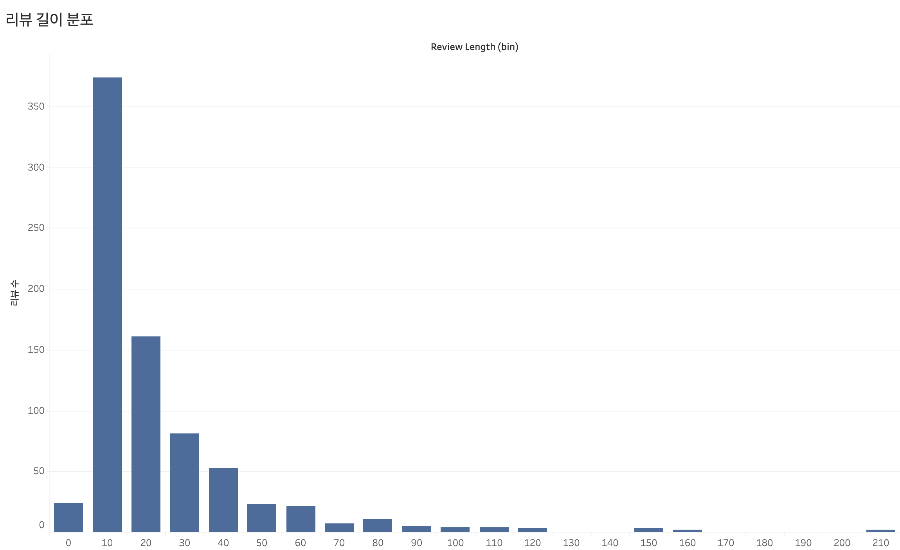
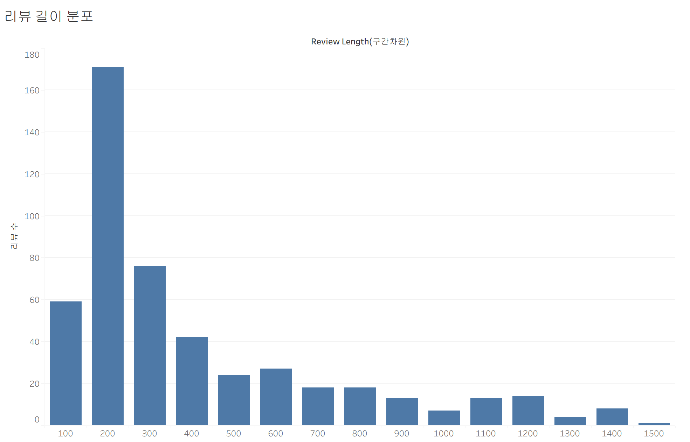
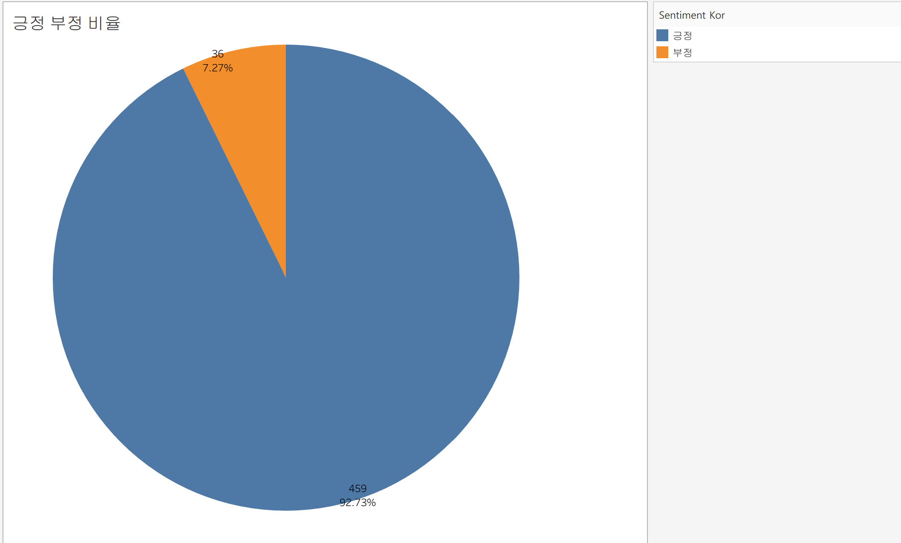

## 리뷰 데이터 크롤링 — YES24 (담당: 소연)

### 데이터 소개

| 항목 | 내용 |
|---|---|
| 사이트 | YES24 - 불편한 편의점 (https://www.yes24.com/product/goods/99308021) |
| 대상 | 도서 <불편한 편의점> 회원리뷰 |
| 수집 개수 | 547개 |
| 저장 경로 | database/reviews_yes24.csv |
| 인코딩 | UTF-8 (BOM) |

**데이터 형식**

| 컬럼 | 타입 | 설명 |
|---|---|---|
| date | str | 리뷰 작성일 (YYYY-MM-DD) |
| rating | int | 회원 평점 (0~10점) |
| review | str | 리뷰 본문 |

- Selenium으로 리뷰 목록(GoodsReviewList)을 PageNumber 단위 URL로 순회하며 수집
- 결측치 없음, 중복 제거 완료

### 실행 방법

```bash
pip install -r requirements.txt

cd review_analysis/crawling
python main.py -o ../../database -c yes24
```


- Selenium으로 각 리뷰 페이지 URL을 순회하며 page_source를 파싱한다. 
- Chrome 브라우저가 필요하며 ChromeDriver는 Selenium Manager가 자동 관리한다.


## 리뷰 데이터 크롤링 — 교보문고 (담당: 찬웅)

### 데이터 소개

| 항목 | 내용 |
|---|---|
| 사이트 | 교보문고 - 불편한 편의점(벚꽃 에디션) (https://product.kyobobook.co.kr/detail/S000001803157) |
| 대상 | 도서 <불편한 편의점(벚꽃 에디션)> Klover 리뷰 |
| 수집 개수 | 800개 |
| 저장 경로 | database/reviews_kyobo.csv |
| 인코딩 | UTF-8 (BOM) |

**데이터 형식**

| 컬럼 | 타입 | 설명 |
|---|---|---|
| stars | float | Klover 별점 (0~4점) |
| date | str | 리뷰 작성일 (YYYY-MM-DD) |
| review | str | 리뷰 본문 |

- 상품 상세페이지의 'Klover 리뷰' 위젯을 열고 페이지 번호 버튼을 순서대로 클릭해 페이지네이션(페이지당 10건)하여 수집
- 별점은 채워진(fill=#4DAC27) 클로버 아이콘 개수로 계산 (아이콘 슬롯은 항상 4개 렌더링되므로 채워진 것만 필터링)

### 실행 방법

```bash
pip install -r requirements.txt

cd review_analysis/crawling
python main.py -o ../../database -c kyobo
```

Selenium + Chrome 드라이버가 필요하다.

### 전처리 & Feature Engineering

| 항목 | 내용 |
|---|---|
| 입력 | database/reviews_kyobo.csv |
| 출력 | database/preprocessed_reviews_kyobo.csv |

- 결측치 제거(`dropna`), 별점 4점 만점 → 5점 만점 스케일링, 범위 밖 값 clip(1~5)
- 리뷰 본문 정제(줄바꿈/반복 특수문자/연속 공백 제거) 후 `kiwipiepy`로 형태소 분석 (명사·동사·형용사만 추출)
- 파생변수: `sentiment_label`(별점 4점 이상 → 1), `review_length`(형태소 분석 전 원본 리뷰 글자 수) 등
- `TfidfVectorizer`로 리뷰 텍스트 벡터화 (`max_features=1000`)

```bash
cd review_analysis/preprocessing
python main.py -o ../../database -c reviews_kyobo
```

### 시각화

`preprocessed_reviews_kyobo.csv`를 Tableau로 시각화한 결과 (이미지: `review_analysis/plots/`).

| 긍정/부정 비율 | 리뷰 길이 분포 |
|---|---|
|  |  |

- 긍정(별점 4점 이상) 비율이 94.1%로 압도적으로 높음
- 리뷰 길이는 대부분 10~30자 사이에 몰려있고, 짧은 한줄평 위주. 일부 100자 이상의 장문 리뷰도 존재하는 롱테일 분포

---

## EDA & 전처리/FE — YES24 (담당: 소연)

### 1. EDA: 데이터 특성 및 이상치

원본 `database/reviews_yes24.csv` (547개)를 대상으로 분포와 이상치를 확인했습니다.

**결측치**: `date`, `rating`, `review` 세 컬럼 모두 결측 0건.

**별점 분포 (원본 0~10 스케일)**

| 별점 | 2 | 4 | 5 | 6 | 7 | 8 | 9 | 10 |
|---|---|---|---|---|---|---|---|---|
| 개수 | 1 | 2 | 3 | 14 | 19 | 90 | 45 | 373 |

- 별점 범위(0~10)를 벗어난 이상치는 **없음**
- 10점이 373개(68.2%)로 **고평점에 극단적으로 쏠린 분포**. 1점, 3점은 아예 존재하지 않음
- 저평점(2~5점)은 6건에 불과해 클래스 불균형이 매우 심함

**날짜 분포**
- 범위: 2021-04-17 ~ 2026-07-25, 파싱 실패 0건
- 미래 날짜나 비정상적으로 오래된 날짜 등 기간 이상치 **없음**

**리뷰 텍스트 길이**

| 통계량 | 값 |
|---|---|
| 최소 | 131자 |
| Q1 | 238.5자 |
| 중앙값 | 370자 |
| Q3 | 796자 |
| 최대 | 5,360자 |

- 오른쪽 꼬리가 매우 긴 **right-skewed 분포**
- IQR 기준 상한(Q3 + 1.5×IQR ≈ 1,632자)을 넘는 장문 리뷰가 다수 존재 → 이것이 이 데이터의 **유일한 실질적 이상치**
- YES24는 최소 글자 수 제한이 있어 지나치게 짧은 리뷰(스팸성)는 발견되지 않음



전처리 후 리뷰 길이 히스토그램(구간 100자)입니다. 200~300자 구간이 172건으로 가장 많고, 오른쪽으로 길게 꼬리가 이어지는 형태가 뚜렷합니다.

---

### 2. 전처리/FE

`review_analysis/preprocessing/yes24_processor.py`의 `YES24Processor`(`BaseDataProcessor` 상속)로 구현했습니다.

**결측치 처리**
- `review_date`, `review_stars`, `review_comment`에 대해 `dropna` 적용
- 원본에 결측이 없어 실제 제거 건수는 0이지만, 재현성과 견고성을 위한 방어 코드로 유지

**이상치 처리**
- **별점**: 0~10 범위를 벗어난 값 제거 (해당 없음)
- **날짜**: 파싱 실패(NaT) 행 제거 (해당 없음)
- **텍스트 길이**: IQR 기준(Q1−1.5×IQR ~ Q3+1.5×IQR) 벗어난 리뷰 제거 → **547건 → 495건 (52건, 9.5% 제거)**

> 제거 판단 근거: 상위 이상치는 오류 데이터가 아니라 정성껏 작성된 장문 서평입니다. 다만 사이트 간 텍스트 비교 시 소수의 장문 리뷰가 키워드 빈도와 평균 길이를 과도하게 좌우하는 문제가 있어 제거했습니다. 손실이 9.5%로 크지 않고, 잔존 495건도 분석에 충분한 규모입니다.

**별점 스케일 통일**
- YES24는 '0~10'점 체계 → 팀 공통 기준인 **0~5점으로 변환** (÷2)
- 반쪽 별(0.5 단위)은 원본 정보 보존을 위해 반올림하지 않고 유지

**텍스트 데이터 전처리**
1. 특수문자 제거 — 한글/영문/숫자/공백만 남김
2. 연속 공백 정규화
3. `kiwipiepy` 형태소 분석 → 명사(NNG, NNP)와 용언 어근(VV, VA)만 추출
4. 불용어 제거 — 일반 불용어 + 1글자 토큰 제거
5. 토큰이 비어버린 행 제거

**파생변수**
- `sentiment_label` — 팀 공통 감성 레이블. 5점 만점 기준 **4점 이상 = 1(긍정), 미만 = 0(부정)**

**텍스트 벡터화**
- **TF-IDF** (`max_features=300`) → `tfidf_*` 컬럼 300개 생성
- 선택 이유: 구현이 빠르고 sklearn만으로 가능하며, 키워드 추출과 문서 유사도 비교에 바로 활용할 수 있고 결과 해석이 직관적임
- 한계: 단어 순서와 문맥 의미를 반영하지 못하며(동음이의어 구분 불가), 신조어·오타에 취약함

**최종 산출물**
- `database/preprocessed_reviews_yes24.csv` — 495행 × 306열

**결과 컬럼**

| 컬럼 | 설명 |
|---|---|
| `review_date` | 리뷰 작성일 |
| `review_stars` | 별점 (0~5 스케일) |
| `review_comment` | 리뷰 원문 |
| `review_comment_clean` | 특수문자 제거된 본문 |
| `sentiment_label` | 감성 레이블 (1=긍정, 0=부정) |
| `tokens` | 형태소 분석 결과 (공백 구분) |
| `tfidf_*` | TF-IDF 벡터 300차원 |

**실행 방법**

```bash
cd review_analysis/preprocessing
python main.py --output_dir ../../database --all
```

---

### 3. 감성 분포



파생변수 `sentiment_label` 기준 긍정/부정 비율입니다 (파란색: 긍정, 주황색: 부정).

- **긍정 459건 (92.73%) / 부정 36건 (7.27%)**
- 별점 분포에서 확인된 고평점 쏠림이 감성 레이블에서도 그대로 나타남
- 이는 YES24 도서 리뷰의 특성으로 볼 수 있습니다. 구매자가 자발적으로 작성하는 구조라 애초에 책에 호의적인 독자가 리뷰를 남길 가능성이 높기 때문입니다
- 다만 이 극단적 불균형은 감성 분석 모델 학습에는 부적합하며, 사이트 간 상대 비교의 기준선으로 활용하는 것이 적절합니다

---

### 시각화 도구

시각화는 **Tableau Public**으로 제작했으며, 그래프 이미지는 `review_analysis/plots/`에 저장되어 있습니다.

`make_tableau_data.py`를 실행하면 `database/preprocessed_reviews_*.csv`를 모두 찾아 Tableau용 long format 데이터(`tableau/tableau_reviews.csv`, `tableau/tableau_keywords.csv`)를 생성합니다. 팀원 전처리본이 추가되면 재실행만으로 사이트 간 비교분석 데이터가 만들어집니다.

```bash
python make_tableau_data.py
```
---
## 리뷰 데이터 크롤링 — Goodreads (담당: 예린)

### 데이터 소개

| 항목 | 내용 |
|---|---|
| 사이트 | Goodreads - 불편한 편의점 ([https://www.goodreads.com/book/show/58481813/reviews?reviewFilters=eyJhZnRlciI6Ik1UUXdNU3d4TnpNM01ESTFNVGd5TlRZNSJ9]) |
| 대상 | 도서 <불편한 편의점> 리뷰 |
| 수집 개수 | 500개 |
| 저장 경로 | database/reviews_goodreads.csv |
| 인코딩 | UTF-8 (BOM) |

**데이터 형식**

| 컬럼 | 타입 | 설명 |
|---|---|---|
| date | str | 리뷰 작성일 (YYYY-MM-DD) |
| stars | int | 회원 별점 (0~5점) |
| review | str | 리뷰 본문 |

### 코드 동작 방식

**API.py 동작 방식**
1. resourceID(굿리즈 작품 고유 ID)로 지정된 <불편한 편의점> 책의 리뷰를 30개 단위로 요청
2. 응답의 'pageInfo.nextPageToken'을 다음 요청의 'pagination.after'에 넣어 반복 호출
3. 3700+ 총 리뷰에 'MAX_REVIEWS' 상한을 두어 500개를 채우면 수집 종료 / 다음 페이지가 없어도 종료하는 것으로 설정
4. 별점이 없거나 작성일이 없는 리뷰 제외
5. 'createdAt' 타임스탬프를 'YYYY-MM-DD' str 로 변환해 다른 csv 파일과 형식 맞춤
6. 리뷰 본문에 섞인 HTML 태그를 Beautiful Soup으로 제거

**왜 Selenium이 아닌 API 직접 호출인가**
- Selenium으로 리뷰 목록(GoodsReviewList)을 PageNumber 단위 URL로 순회하며 수집하였으나, 30개 수집 후 "show more reviews" 버튼 눌러 다음 페이지로 넘어갈때 봇 감지 -> 실패
- Selenium 코드로는 봇 감지가 되어, 비로그인 상태로 코드를 돌리면 30개가 수집 상한
- 500개+ 수집을 위해서 HTML 구조 확인: Goodreads 프론트엔드는 "show more reviews" 버튼을 누를때 Gr
- aphql API 호출로 다음 페이지를 불러오는 방식
- 다음 페이지로 넘어가는 호출을 코드로 직접한다면, 봇 감지 없이 원하는 만큼 리뷰 수집 가능.

**한계**
- 실제 Goodreads에서 페이지를 넘길때 쓰는 'X-Api-Key' 공개 api key를 코드에 하드 코딩하여, api key 변경시 코드가 작동하지 않을 수 있음
- 실제 api key를 public git에 업로드하는 것은 권장되지 않는다는 걸 인지하고 있으나, 대안책으로 매번 env에서 팀원들/ 과제 검수하는 분들이 api key를 직접 찾는 것도 번거롭고 별로라는 생각이 들었습니다. 

### 실행 방법

```bash
python review_analysis/crawling/goodreads_api.py
```


