## 👥 팀 소개

같은 콘텐츠(도서 **『불편한 편의점』**)의 리뷰를 서로 다른 플랫폼 3곳에서 수집해,
플랫폼별로 리뷰가 어떻게 다른지 비교 분석하는 YBIGTA 신입기수 5조입니다.
팀원 3명이 각각 다른 리뷰 사이트를 하나씩 맡아 크롤링하고, 이후 텍스트·시계열 분석을 함께 진행합니다.

| 이름 | 학과 | 담당 사이트 |
|------|------|-------------|
| 윤찬웅 | 물리학과 | 교보문고 |
| 김소연 | 도시공학과 / 국어국문학과 | YES24 |
| 김예린 | 국제대학 경제학과 | Goodreads |

## 🙋 팀원 자기소개

### 윤찬웅 (물리학과)
물리학과 3학년 재학 중입니다.
**서버**와 **클라우드** 쪽에 관심이 많아 배포 환경과 **CI/CD** 파이프라인을 직접 굴려보는 걸 좋아합니다.
코드를 짜는 것만큼 그 코드가 안정적으로 돌아가고 자동으로 배포되는 구조를 만드는 데 관심이 있습니다.
이번 프로젝트에서는 **교보문고** 리뷰 크롤러를 맡았습니다.

### 김소연 (도시공학과 / 국어국문학과)
도시공학과 국어국문학을 함께 공부하고 있습니다.
데이터 자체보다, 그 안의 맥락과 변수 간 관계를 엮어 인사이트를 발견하는 것에 흥밀를 느낍니다. 데이터 분석의 기반이 되는 쿼리나, DB 공부에도 관심이 있습니다.
이번 프로젝트에서는 **YES24** 리뷰 크롤러를 맡았습니다.

### 김예린 (국제대학 경제학과)
국제대학 경제학과에 재학 중입니다.
딥러닝 수업을 듣고 데이터에 관심을 가지게 되었으며, DL 모델 트레이닝, 파라미터 조정에 관심있습니다. DA와 DE 분야에도 흥미를 키워가고 있으며, 특히 시각화 툴이 흥미롭습니다. 
이번 프로젝트에서는 해외 리뷰 플랫폼인 **Goodreads** 크롤러를 맡았습니다.

## 🚀 실행 방법 모음

```bash
pip install -r requirements.txt
```

**Web (FastAPI 서버)**

```bash
uvicorn app.main:app --reload --port 8000
```

**크롤링**

```bash
cd review_analysis/crawling
python main.py -o ../../database -c kyobo      # 교보문고
python main.py -o ../../database -c yes24      # YES24
python goodreads_api.py                        # Goodreads
```

**EDA·FE (전처리)**

```bash
cd review_analysis/preprocessing
python main.py --output_dir ../../database --all
```

각 과제별 세부 데이터 소개, 코드 동작 방식, EDA/전처리 설명은 아래 섹션에서 확인할 수 있습니다.

## 🔐 GitHub 협업 (브랜치 보호 & PR 리뷰)

| Branch protection 설정 | main 직접 push 거부 | PR 리뷰 및 merge |
|---|---|---|
| 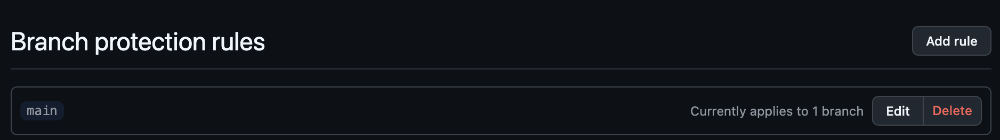 | 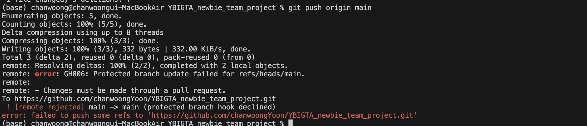 | 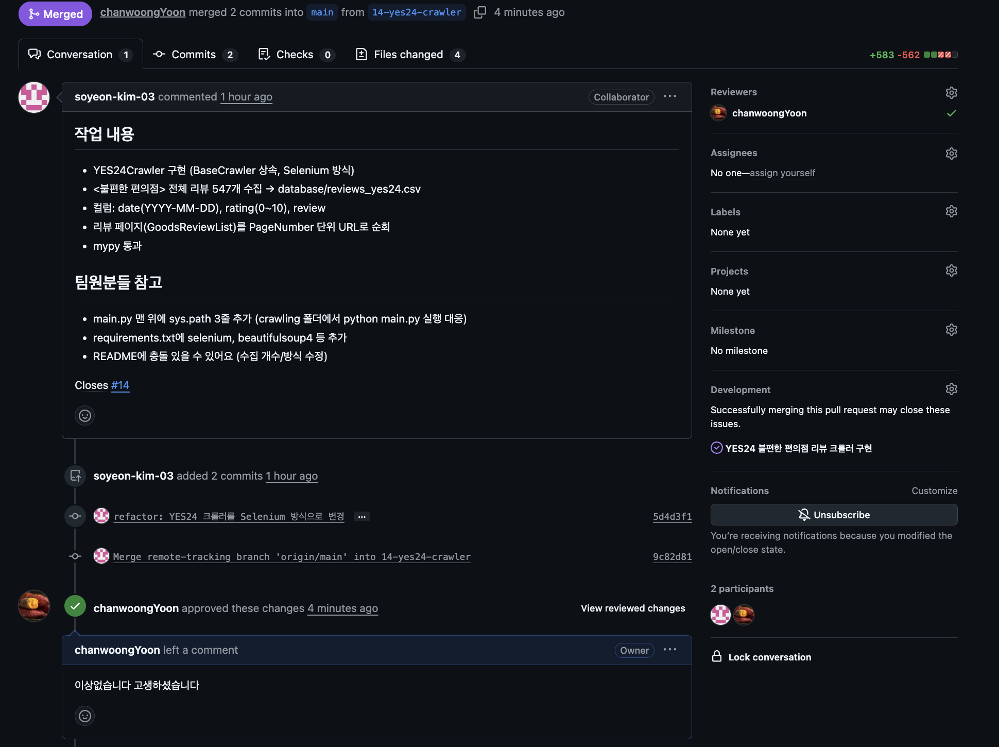 |

- `main` 브랜치에 Require a pull request before merging + Do not allow bypassing 규칙 적용
- 팀원들은 각자 브랜치에서 작업 후 PR을 생성하고, Reviewer가 코멘트를 남긴 뒤 merge


### 1. 유저 정보 MySQL CRUD

`database/mysql_connection.py`에서 `.env`를 읽어 `DB_URL`을 구성하고, SQLAlchemy `engine`/`SessionLocal`을 생성합니다.

| 항목 | 내용 |
|---|---|
| ORM | SQLAlchemy (`declarative_base`) |
| 드라이버 | PyMySQL |
| 테이블명 | `users` (email PK, password, username 모두 NOT NULL) |

**`app/user/user_repository.py`**
- `UserRepository`가 생성자에서 `db: Session`을 주입받는 구조로 변경 (기존 JSON 파일 기반 → DB 세션 기반)
- `UserORM` 모델 클래스로 `users` 테이블 매핑
- `get_user_by_email`: `session.query(UserORM).filter(...)`로 조회 후 pydantic `User`로 변환
- `save_user`: 이메일 존재 여부를 조회해 있으면 UPDATE, 없으면 INSERT하는 upsert 로직
- `delete_user`: 조회 후 `session.delete()` + `commit()`

**`app/dependencies.py`**
- `get_db()`: 요청마다 `SessionLocal()`로 세션을 만들고 `yield` 후 `finally`에서 `close()`하는 FastAPI 의존성 함수 추가
- `get_user_repository`가 `Depends(get_db)`로 세션을 주입받아 `UserRepository`를 생성하도록 변경

**테스트**
```bash
pytest test/test_user_repository.py -v
```
SQLite 인메모리 DB 기준 4개 테스트(`save`, `get`, `update`, `delete`) 모두 통과.

### 2. 리뷰 데이터 MongoDB 전처리 자동화

크롤링한 원본 CSV는 MongoDB Compass로 `reviews_{site_name}` 컬렉션에 적재했습니다 (`goodreads`, `kyobo`, `yes24`).

**`review_analysis/preprocessing/base_processor.py`**
- 기존 CSV 경로 기반(`input_path`, `output_dir`) → MongoDB 컬렉션 기반으로 변경
- 생성자에서 `input_collection.find()` 결과를 바로 `pandas.DataFrame`으로 변환해 `self.df`에 저장
- `save_to_database()`를 공통 로직으로 구현: 재실행 시 결과가 누적되지 않도록 `output_collection`을 비운 뒤 `insert_many`로 저장
- ⚠️ 세 사이트가 완전히 동일한 Mongo 읽기/쓰기 로직을 반복하는 걸 피하려고 부모 클래스를 수정했습니다. 과제 PDF의 파일 트리 주석엔 별도 표시가 없어, 운영진 확인 후 필요시 각 프로세서 클래스에 로직을 개별로 넣는 방식으로 되돌릴 수 있습니다.
- `goodreads_processor.py`, `kyobo_processor.py`, `yes24_processor.py`는 CSV 읽기/쓰기 로직만 제거하고, 기존 `preprocess`/`feature_engineering` 로직은 그대로 유지

**`app/review/review_router.py`** (신규)

| Method | Endpoint | 설명 |
|---|---|---|
| POST | `/review/preprocess/{site_name}` | `reviews_{site_name}` 컬렉션을 조회 → 해당 사이트 전처리 클래스 실행 → `preprocessed_reviews_{site_name}` 컬렉션에 저장 |

`site_name`은 `goodreads` / `kyobo` / `yes24`를 지원하며, 등록되지 않은 값이면 404를 반환합니다.

```bash
curl -X POST http://localhost:8000/review/preprocess/goodreads
```

## 리뷰 데이터 크롤링 — YES24 (담당: 소연)

### 데이터 소개

| 항목 | 내용 |
|---|---|
| 사이트 | YES24 - 불편한 편의점 (https://www.yes24.com/product/goods/99308021) |
| 대상 | 도서 <불편한 편의점> 회원리뷰 |
| 수집 개수 | 547개 |
| 저장 경로 | database/reviews_yes24.csv |
| 인코딩 | UTF-8 (BOM) |

**데이터 형식**

| 컬럼 | 타입 | 설명 |
|---|---|---|
| date | str | 리뷰 작성일 (YYYY-MM-DD) |
| rating | int | 회원 평점 (0~10점) |
| review | str | 리뷰 본문 |

- Selenium으로 리뷰 목록(GoodsReviewList)을 PageNumber 단위 URL로 순회하며 수집
- 결측치 없음, 중복 제거 완료

### 실행 방법

```bash
pip install -r requirements.txt

cd review_analysis/crawling
python main.py -o ../../database -c yes24
```


- Selenium으로 각 리뷰 페이지 URL을 순회하며 page_source를 파싱한다. 
- Chrome 브라우저가 필요하며 ChromeDriver는 Selenium Manager가 자동 관리한다.


## 리뷰 데이터 크롤링 — 교보문고 (담당: 찬웅)

### 데이터 소개

| 항목 | 내용 |
|---|---|
| 사이트 | 교보문고 - 불편한 편의점(벚꽃 에디션) (https://product.kyobobook.co.kr/detail/S000001803157) |
| 대상 | 도서 <불편한 편의점(벚꽃 에디션)> Klover 리뷰 |
| 수집 개수 | 800개 |
| 저장 경로 | database/reviews_kyobo.csv |
| 인코딩 | UTF-8 (BOM) |

**데이터 형식**

| 컬럼 | 타입 | 설명 |
|---|---|---|
| stars | float | Klover 별점 (0~4점) |
| date | str | 리뷰 작성일 (YYYY-MM-DD) |
| review | str | 리뷰 본문 |

- 상품 상세페이지의 'Klover 리뷰' 위젯을 열고 페이지 번호 버튼을 순서대로 클릭해 페이지네이션(페이지당 10건)하여 수집
- 별점은 채워진(fill=#4DAC27) 클로버 아이콘 개수로 계산 (아이콘 슬롯은 항상 4개 렌더링되므로 채워진 것만 필터링)

### 실행 방법

```bash
pip install -r requirements.txt

cd review_analysis/crawling
python main.py -o ../../database -c kyobo
```

Selenium + Chrome 드라이버가 필요하다.

### 전처리 & Feature Engineering

| 항목 | 내용 |
|---|---|
| 입력 | database/reviews_kyobo.csv |
| 출력 | database/preprocessed_reviews_kyobo.csv |

- 결측치 제거(`dropna`), 별점 4점 만점 → 5점 만점 스케일링, 범위 밖 값 clip(1~5)
- 리뷰 본문 정제(줄바꿈/반복 특수문자/연속 공백 제거) 후 `kiwipiepy`로 형태소 분석 (명사·동사·형용사만 추출)
- 파생변수: `sentiment_label`(별점 4점 이상 → 1), `review_length`(형태소 분석 전 원본 리뷰 글자 수) 등
- `TfidfVectorizer`로 리뷰 텍스트 벡터화 (`max_features=1000`)

```bash
cd review_analysis/preprocessing
python main.py -o ../../database -c reviews_kyobo
```

### 시각화

`preprocessed_reviews_kyobo.csv`를 Tableau로 시각화한 결과 (이미지: `review_analysis/plots/`).

| 긍정/부정 비율 | 리뷰 길이 분포 |
|---|---|
|  |  |

- 긍정(별점 4점 이상) 비율이 94.1%로 압도적으로 높음
- 리뷰 길이는 대부분 10~30자 사이에 몰려있고, 짧은 한줄평 위주. 일부 100자 이상의 장문 리뷰도 존재하는 롱테일 분포

---

## EDA & 전처리/FE — YES24 (담당: 소연)

### 1. EDA: 데이터 특성 및 이상치

원본 `database/reviews_yes24.csv` (547개)를 대상으로 분포와 이상치를 확인했습니다.

**결측치**: `date`, `rating`, `review` 세 컬럼 모두 결측 0건.

**별점 분포 (원본 0~10 스케일)**

| 별점 | 2 | 4 | 5 | 6 | 7 | 8 | 9 | 10 |
|---|---|---|---|---|---|---|---|---|
| 개수 | 1 | 2 | 3 | 14 | 19 | 90 | 45 | 373 |

- 별점 범위(0~10)를 벗어난 이상치는 **없음**
- 10점이 373개(68.2%)로 **고평점에 극단적으로 쏠린 분포**. 1점, 3점은 아예 존재하지 않음
- 저평점(2~5점)은 6건에 불과해 클래스 불균형이 매우 심함

**날짜 분포**
- 범위: 2021-04-17 ~ 2026-07-25, 파싱 실패 0건
- 미래 날짜나 비정상적으로 오래된 날짜 등 기간 이상치 **없음**

**리뷰 텍스트 길이**

| 통계량 | 값 |
|---|---|
| 최소 | 131자 |
| Q1 | 238.5자 |
| 중앙값 | 370자 |
| Q3 | 796자 |
| 최대 | 5,360자 |

- 오른쪽 꼬리가 매우 긴 **right-skewed 분포**
- IQR 기준 상한(Q3 + 1.5×IQR ≈ 1,632자)을 넘는 장문 리뷰가 다수 존재 → 이것이 이 데이터의 **유일한 실질적 이상치**
- YES24는 최소 글자 수 제한이 있어 지나치게 짧은 리뷰(스팸성)는 발견되지 않음


전처리 후 리뷰 길이 히스토그램(구간 100자)입니다. 200~300자 구간이 172건으로 가장 많고, 오른쪽으로 길게 꼬리가 이어지는 형태가 뚜렷합니다.

---

### 2. 전처리/FE

`review_analysis/preprocessing/yes24_processor.py`의 `YES24Processor`(`BaseDataProcessor` 상속)로 구현했습니다.

**결측치 처리**
- `review_date`, `review_stars`, `review_comment`에 대해 `dropna` 적용
- 원본에 결측이 없어 실제 제거 건수는 0이지만, 재현성과 견고성을 위한 방어 코드로 유지

**이상치 처리**
- **별점**: 0~10 범위를 벗어난 값 제거 (해당 없음)
- **날짜**: 파싱 실패(NaT) 행 제거 (해당 없음)
- **텍스트 길이**: IQR 기준(Q1−1.5×IQR ~ Q3+1.5×IQR) 벗어난 리뷰 제거 → **547건 → 495건 (52건, 9.5% 제거)**

> 제거 판단 근거: 상위 이상치는 오류 데이터가 아니라 정성껏 작성된 장문 서평입니다. 다만 사이트 간 텍스트 비교 시 소수의 장문 리뷰가 키워드 빈도와 평균 길이를 과도하게 좌우하는 문제가 있어 제거했습니다. 손실이 9.5%로 크지 않고, 잔존 495건도 분석에 충분한 규모입니다.

**별점 스케일 통일**
- YES24는 '0~10'점 체계 → 팀 공통 기준인 **0~5점으로 변환** (÷2)
- 반쪽 별(0.5 단위)은 원본 정보 보존을 위해 반올림하지 않고 유지

**텍스트 데이터 전처리**
1. 특수문자 제거 — 한글/영문/숫자/공백만 남김
2. 연속 공백 정규화
3. `kiwipiepy` 형태소 분석 → 명사(NNG, NNP)와 용언 어근(VV, VA)만 추출
4. 불용어 제거 — 일반 불용어 + 1글자 토큰 제거
5. 토큰이 비어버린 행 제거

**파생변수**
- `sentiment_label` — 팀 공통 감성 레이블. 5점 만점 기준 **4점 이상 = 1(긍정), 미만 = 0(부정)**

**텍스트 벡터화**
- **TF-IDF** (`max_features=300`) → `tfidf_*` 컬럼 300개 생성
- 선택 이유: 구현이 빠르고 sklearn만으로 가능하며, 키워드 추출과 문서 유사도 비교에 바로 활용할 수 있고 결과 해석이 직관적임
- 한계: 단어 순서와 문맥 의미를 반영하지 못하며(동음이의어 구분 불가), 신조어·오타에 취약함

**최종 산출물**
- `database/preprocessed_reviews_yes24.csv` — 495행 × 306열

**결과 컬럼**

| 컬럼 | 설명 |
|---|---|
| `review_date` | 리뷰 작성일 |
| `review_stars` | 별점 (0~5 스케일) |
| `review_comment` | 리뷰 원문 |
| `review_comment_clean` | 특수문자 제거된 본문 |
| `sentiment_label` | 감성 레이블 (1=긍정, 0=부정) |
| `tokens` | 형태소 분석 결과 (공백 구분) |
| `tfidf_*` | TF-IDF 벡터 300차원 |

**실행 방법**

```bash
cd review_analysis/preprocessing
python main.py --output_dir ../../database --all
```

---

### 3. 감성 분포


파생변수 `sentiment_label` 기준 긍정/부정 비율입니다 (파란색: 긍정, 주황색: 부정).

- **긍정 459건 (92.73%) / 부정 36건 (7.27%)**
- 별점 분포에서 확인된 고평점 쏠림이 감성 레이블에서도 그대로 나타남
- 이는 YES24 도서 리뷰의 특성으로 볼 수 있습니다. 구매자가 자발적으로 작성하는 구조라 애초에 책에 호의적인 독자가 리뷰를 남길 가능성이 높기 때문입니다
- 다만 이 극단적 불균형은 감성 분석 모델 학습에는 부적합하며, 사이트 간 상대 비교의 기준선으로 활용하는 것이 적절합니다

---
### 4. 월별 리뷰량 추이

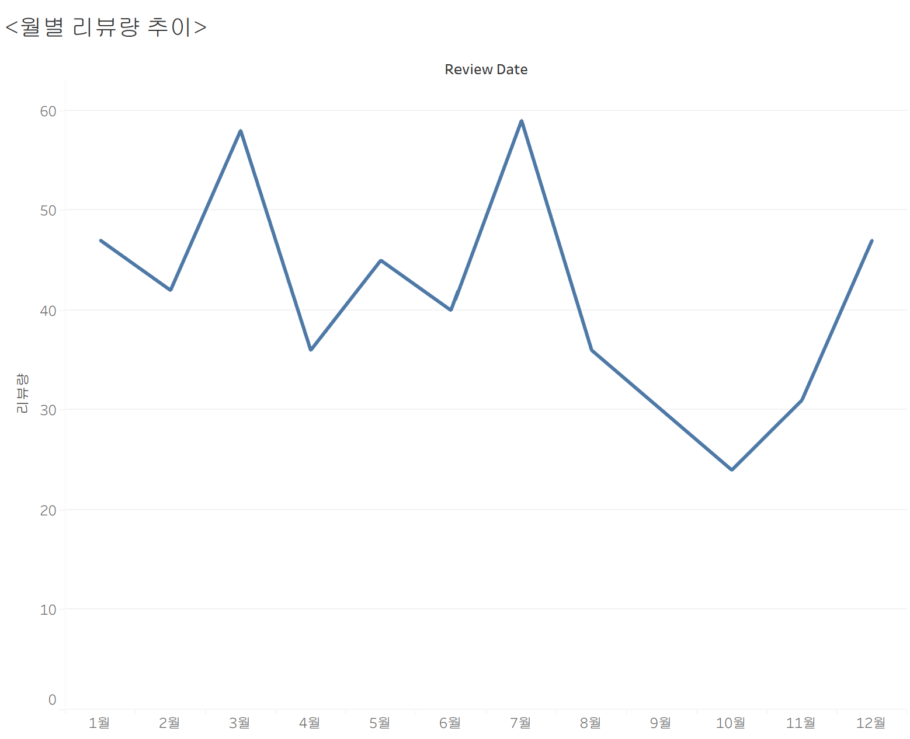

`review_date`를 월 단위로 집계한 리뷰량 추이입니다. 사이트 간 비교를 위해 **연도를 합산하여 1~12월로 집계**했습니다.

- 7월(59건)과 3월(58건)에 두 개의 뚜렷한 peak가 나타남
- 10월(24건)이 최저점이며, 8~11월이 전반적으로 저조함
- 12월(47건)에 다시 반등하는 패턴

여름 휴가철과 연말·연초에 독서량이 늘어나는 일반적인 계절성과 일치하는 것으로 보이나, 단일 사이트 데이터만으로는 계절 효과인지 우연인지 단정하기 어렵습니다.

**한계**: 연도를 합산했기 때문에 출간(2021년) 이후 시간에 따른 리뷰량 변화, 즉 베스트셀러 라이프사이클은 이 그래프에서 확인할 수 없습니다. 연도별 추이를 보려면 별도의 연속 시계열 집계가 필요하나, 사이트마다 수집 기간이 달라 비교 목적에는 월 단위 집계를 우선했습니다.

---
### 시각화 도구

시각화는 **Tableau Public**으로 제작했으며, 그래프 이미지는 `review_analysis/plots/`에 저장되어 있습니다.

`make_tableau_data.py`를 실행하면 `database/preprocessed_reviews_*.csv`를 모두 찾아 Tableau용 long format 데이터(`tableau/tableau_reviews.csv`, `tableau/tableau_keywords.csv`)를 생성합니다. 팀원 전처리본이 추가되면 재실행만으로 사이트 간 비교분석 데이터가 만들어집니다.

```bash
python make_tableau_data.py
```
---
## 1. 리뷰 데이터 크롤링 — Goodreads (담당: 예린)

### 데이터 소개

| 항목 | 내용 |
|---|---|
| 사이트 | Goodreads - 불편한 편의점 ([https://www.goodreads.com/book/show/58481813/reviews?reviewFilters=eyJhZnRlciI6Ik1UUXdNU3d4TnpNM01ESTFNVGd5TlRZNSJ9]) |
| 대상 | 도서 <불편한 편의점> 리뷰 |
| 수집 개수 | 500개 |
| 저장 경로 | database/reviews_goodreads.csv |
| 인코딩 | UTF-8 (BOM) |

**데이터 형식**

| 컬럼 | 타입 | 설명 |
|---|---|---|
| date | str | 리뷰 작성일 (YYYY-MM-DD) |
| stars | int | 회원 별점 (0~5점) |
| review | str | 리뷰 본문 |

### 코드 동작 방식

**API.py 동작 방식**
1. resourceID(굿리즈 작품 고유 ID)로 지정된 <불편한 편의점> 책의 리뷰를 30개 단위로 요청
2. 응답의 'pageInfo.nextPageToken'을 다음 요청의 'pagination.after'에 넣어 반복 호출
3. 3700+ 총 리뷰에 'MAX_REVIEWS' 상한을 두어 500개를 채우면 수집 종료 / 다음 페이지가 없어도 종료하는 것으로 설정
4. 별점이 없거나 작성일이 없는 리뷰 제외
5. 'createdAt' 타임스탬프를 'YYYY-MM-DD' str 로 변환해 다른 csv 파일과 형식 맞춤
6. 리뷰 본문에 섞인 HTML 태그를 Beautiful Soup으로 제거

**왜 Selenium이 아닌 API 직접 호출인가**
- Selenium으로 리뷰 목록(GoodsReviewList)을 PageNumber 단위 URL로 순회하며 수집하였으나, 30개 수집 후 "show more reviews" 버튼 눌러 다음 페이지로 넘어갈때 봇 감지 -> 실패
- Selenium 코드로는 봇 감지가 되어, 비로그인 상태로 코드를 돌리면 30개가 수집 상한
- 500개+ 수집을 위해서 HTML 구조 확인: Goodreads 프론트엔드는 "show more reviews" 버튼을 누를때 Gr
- aphql API 호출로 다음 페이지를 불러오는 방식
- 다음 페이지로 넘어가는 호출을 코드로 직접한다면, 봇 감지 없이 원하는 만큼 리뷰 수집 가능.

**한계**
- 실제 Goodreads에서 페이지를 넘길때 쓰는 'X-Api-Key' 공개 api key를 코드에 하드 코딩하여, api key 변경시 코드가 작동하지 않을 수 있음
- 실제 api key를 public git에 업로드하는 것은 권장되지 않는다는 걸 인지하고 있으나, 대안책으로 매번 env에서 팀원들/ 과제 검수하는 분들이 api key를 직접 찾는 것도 번거롭고 별로라는 생각이 들었습니다. 

### 실행 방법

```bash
python review_analysis/crawling/goodreads_api.py
```

## 2. Goodreads 크롤링 데이터 전처리/FE (담당: 예린)

###전처리 이전 번역하는 코드 작성
전처리 과정 (preprocessing 스켈레톤 코드 사용해 'goodreads_processor.py' 작성) 이전에, 
다양한 언어로 되어 있는 goodreads 본문 리뷰를 번역하는 코드 'review_analysis/crawling/goodreads_translator.py'를 작성해, 
"reviews_goodreads_ko.csv"를 생성했습니다.


### 전처리 코드
"reviews_goodreads_ko.csv"를 전처리로 한 번 더 정제하는 코드를 작성했습니다. 
`review_analysis/preprocessing/goodreads_processor.py`의 `GoodreadsProcessor`(`BaseDataProcessor` 상속)로 구현했습니다.
- 필수 컬럼: stars(1~5 정수 별점), date, review(리뷰 원문)
- 생성자(__init__)에서 input_path를 utf-8-sig 인코딩으로 읽어 self.df에 로드합니다.

**결측치 처리**
- `date`, `stars`, `review` 칼럼에 대해 `dropna` 적용해 하나라도 비어있는 행을 정리했습니다. 

**이상치 처리**
- **별점**: 1~5 범위를 벗어난 값 제거했습니다.
- **리뷰 길이**: 텍스트 정리가 끝난 정제된 리뷰 기준으로 길이가 10자 미만이거나 1000자를 초과하는 행을 제거했습니다.
(기존에는 이 과정이 텍스트 정리 이전에 왔으나, run했을때 이모티콘 등이 제거되지 않은 리뷰의 경우, 1000자 초과 행이 많으며,
1000자가 유효한 이상치 기준이라 볼 수 없어 텍스트 정리 후, 코드상 리뷰길이에 대한 이상치 처리를 진행했습니다.)

**텍스트 정리**
- **특수문자 제거**: 한글(가-힣), 영문자, 숫자, 공백을 제외한 모든 문자를 공백(" ")으로 치환합니다.
- **공백 제거**: 연속된 공백을 하나로 합치고 앞뒤 공백을 제거합니다.

###Feature Engineering 코드 
**감성 레이블 생성**
- stars >= 4인 경우 is_positive = 1, 아니면 0으로 하는 이진 파생변수를 만듭니다.
  
**TF-IDF 벡터화**
- 정제된 review 컬럼을 TfidfVectorizer(max_features=300)로 벡터화하여 최대 300개의 단어 특징을 추출합니다.
  
**결합** 
- TF-IDF 결과를 데이터프레임으로 변환한 뒤, 기존 데이터프레임(stars, date, review, is_positive)과 컬럼 방향(axis=1)으로 합칩니다.

###Save to database 코드
**전처리, FE가 끝난 결과를 전부 csv 파일에 저장합니다**
- self.output_dir(생성자에 전달된 output_path) 아래에 preprocessed_reviews_goodreads.csv 이름으로 저장합니다.
- 인코딩은 utf-8-sig(엑셀에서 한글 깨짐 방지)로 저장합니다.
- 저장된 행 수를 콘솔에 출력합니다.
  
## 3. Goodreads 크롤링 데이터 시각화 (담당: 예린)
**태블로를 활용해 세 가지 그래프로 전처리한 데이터를 시각화했습니다.**
- 그래프 이미지는 `review_analysis/plots/`에 저장되어 있습니다.
  1. 별점 분포 (막대) - 4점이 213개로 압도적, 4점이상이 전체 평점의 약 50%이상으로 보아, 고평점 쏠림 확인
  2. 월별 리뷰 추이 (라인) - 5,6월에 리뷰량이 정점을 찍은 후 월말로 갈수록 급감함을 확인
  3. 긍정/부정 비율 (파이) — 별점 4점이상을 긍정신호로 바라보고, FE에서 생성한 파생변수(감성레이블 'is_positive')를 그래프화함
     - is positive는 이진함수로, 긍정(별점 4점이상)= 1, 부정=0입니다. 
     - 긍정이 71.75% vs 부정 28.25%, 극단적으로 긍정 쏠림


**교보 vs. Yes24 vs. Goodreads**
1. 세 가지 사이트에서 수집한 공통 파생변수 감성레이블 'is_positive'을 시각화한 그래프 비교 분석시,
- Goodreads (긍정: 71.75%, 부정: 28.25%) | 긍정이 많지만 부정도 약 3할로 존재
- Kyobo (긍정: 94.1%, 부정: 5.9%) | 압도적으로 긍정 비율이 높음
- Yes24 (긍정: 92.73%, 부정: 7.27%) | 교보 리뷰와 거의 동일한 분포

결론적으로, 다국적 multilingual 사이트인 Goodreads가 한국 도서 리뷰 사이트인 교보문고, 예스24보다 비판적인 리뷰가 많으며, 독자의 다양한 의견을 기대할 수 있음을 알 수 있습니다. 하지만 전반적으로 <불편한 편의점>에 대한 리뷰는 긍정적인 편이므로, 읽어볼만한 도서임을 결론 지을 수 있습니다. 

2. 세 가지 사이트에서 시계열 데이터 (월별 리뷰량 추이) 비교 분석시,
- 세 플랫폼 모두 리뷰량은 시간에 따라 변화하지만 변화 양상은 서로 달랐습니다.
- Goodreads는 상반기 이후 점진적으로 감소하는 전형적인 라이프사이클 패턴을 보였습니다.
- YES24는 3월, 7월, 12월에 리뷰가 증가하는 계절성이 나타났습니다.
- 교보문고는 2월에 리뷰가 가장 많이 생성된 이후 빠르게 감소하였습니다. 초기 판매 효과가 가장 강하게 나타난 플랫폼으로 해석할 수 있습니다. 


#Docker 과제 

## AWS 인프라 구성

| 구성 요소 | 서비스 | 설정 |
|---|---|---|
| 애플리케이션 서버 | EC2 (t3.micro, Amazon Linux 2023) | 탄력적 IP 연결, Docker 실행 |
| 관계형 DB | RDS MySQL 8.4 (db.t3.micro) | 프라이빗 서브넷, 퍼블릭 액세스 차단 |
| 문서형 DB | MongoDB Atlas (M0) | IP Access List로 EC2만 허용 |

리전은 모두 서울(ap-northeast-2)로 통일하여 EC2와 RDS가 동일 VPC(vpc-072f4251cbe7a5068) 내에 위치하도록 구성했습니다.

## Docker Hub

https://hub.docker.com/r/chanwoongyoon/ybigta-newbie-project

## API 실행 결과

배포된 애플리케이션은 Application Load Balancer를 통해 접근합니다.

### 회원가입

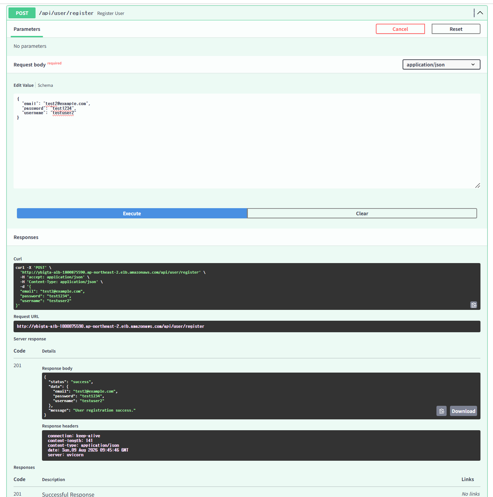

### 로그인

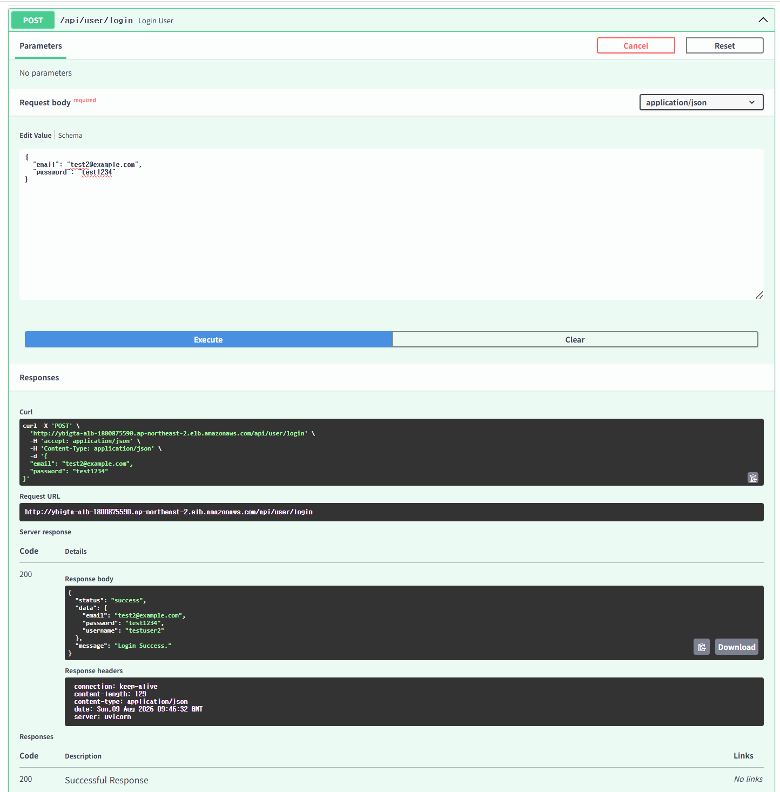

### 비밀번호 변경

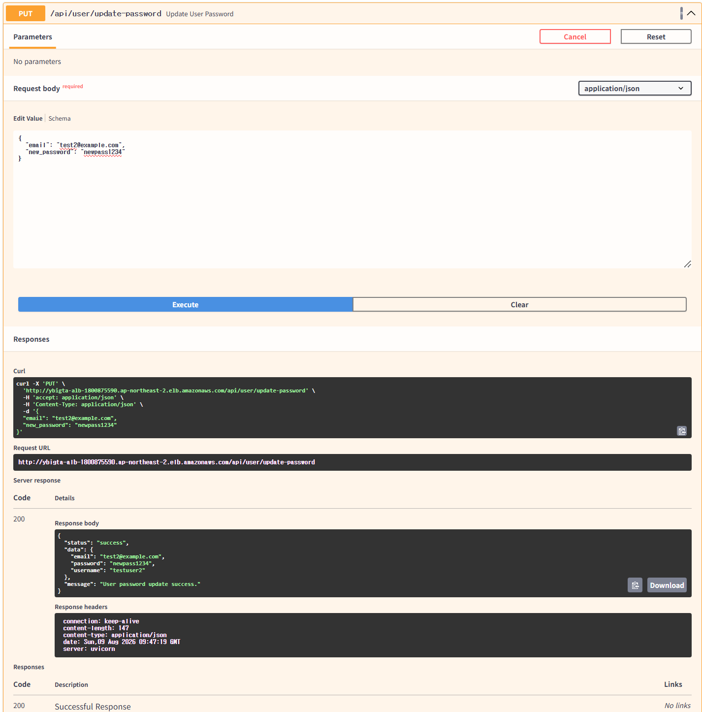

### 회원 탈퇴

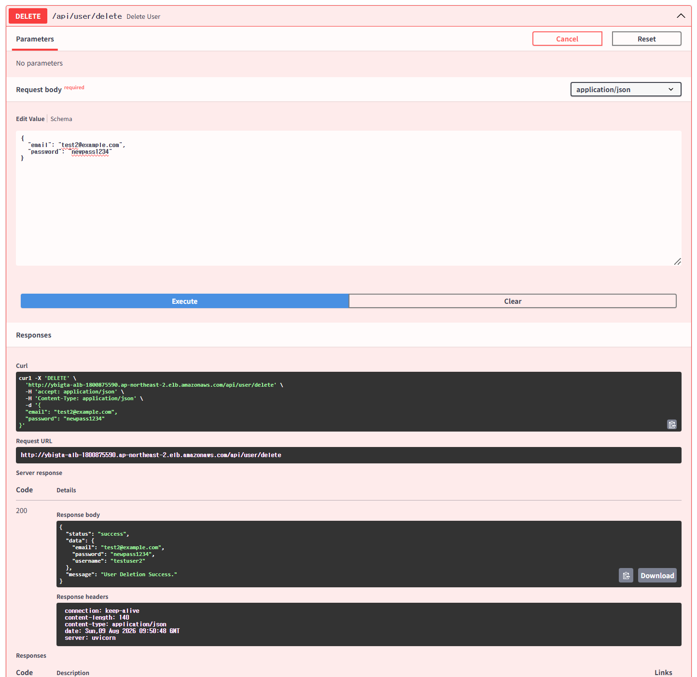

### 리뷰 전처리

MongoDB에 적재된 원본 리뷰를 조회하여 전처리한 뒤 다시 MongoDB에 저장합니다.

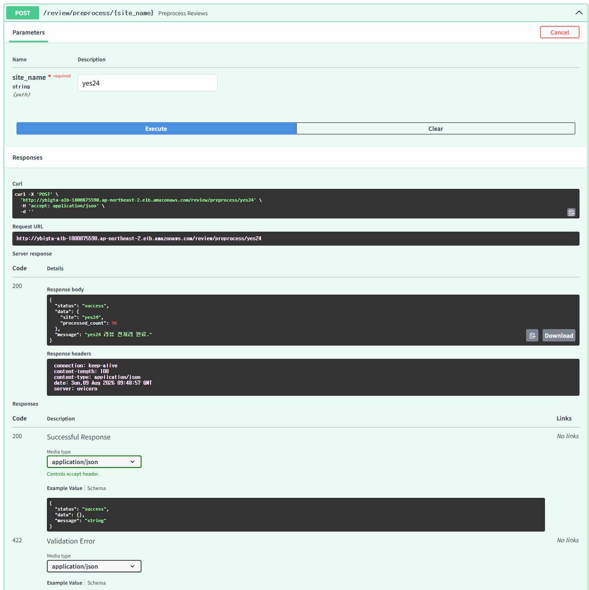

### 헬스 체크

로드 밸런서의 타겟 그룹 상태 확인에 사용됩니다.

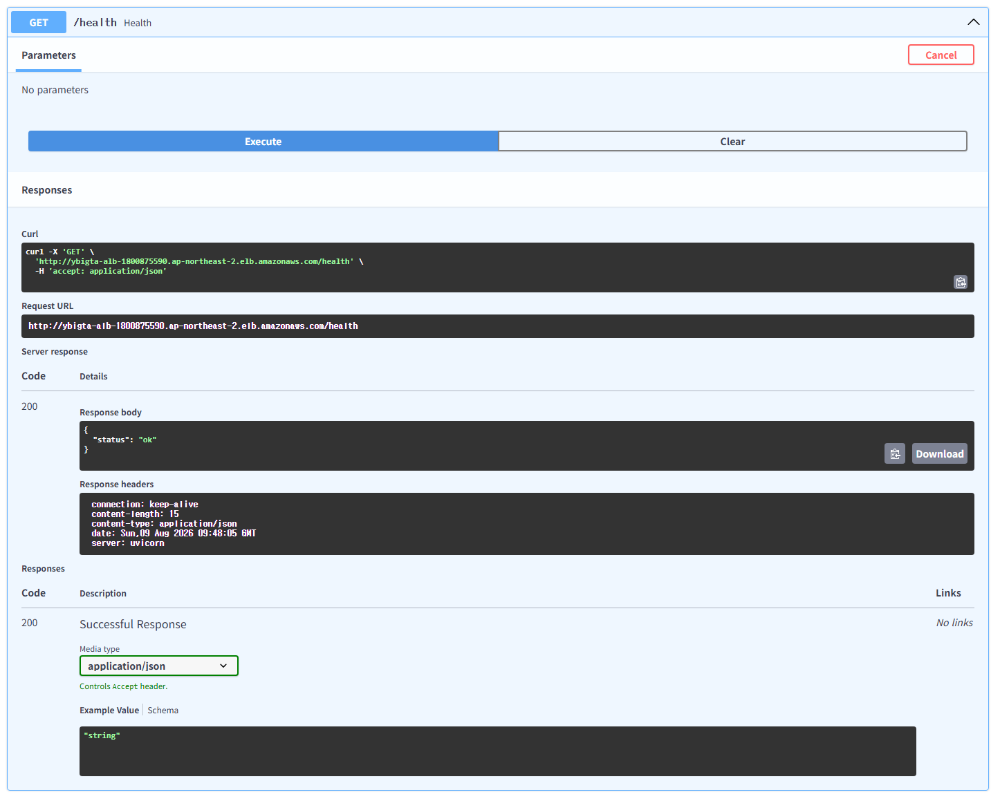


## RDS 보안 설정: 퍼블릭 액세스 차단과 프라이빗 서브넷

### 1. 퍼블릭 액세스 비활성화

RDS 인스턴스 생성 시 퍼블릭 액세스를 비활성화하여 퍼블릭 IP를 할당받지 않도록 했습니다. 인터넷 구간에서 DB로 직접 접근하는 경로가 존재하지 않으며, 동일 VPC 내부 리소스만 연결할 수 있습니다.

### 2. 프라이빗 서브넷 배치

퍼블릭 액세스를 껐더라도 인스턴스가 퍼블릭 서브넷에 있다면, 해당 서브넷의 라우팅 테이블에는 인터넷 게이트웨이(IGW) 경로가 존재합니다. 기본 VPC의 서브넷은 모두 이 상태입니다. 네트워크 계층에서부터 외부 경로를 차단하기 위해 별도의 프라이빗 서브넷을 구성했습니다.

- `ybigta-private-rt` 라우팅 테이블 생성 — IGW 경로 없이 `172.31.0.0/16 → local` 만 보유
- `subnet-00edb02c8c8222049`(ap-northeast-2a), `subnet-0ccadfd160862a03c`(ap-northeast-2b)를 이 라우팅 테이블에 연결
- 두 서브넷으로 `ybigta-private-subnet-group`을 구성하여 RDS 배치

EC2가 사용하는 서브넷(ap-northeast-2c)은 SSH 접속과 Docker 이미지 pull이 필요하므로 퍼블릭으로 유지했습니다.

### 3. 보안 그룹 분리와 그룹 참조

보안 그룹을 역할별로 분리하고, RDS의 인바운드 소스로 IP 대역이 아닌 **EC2 보안 그룹 자체를 참조**하도록 설정했습니다.

- `ybigta-ec2-sg` (EC2): SSH(22), 애플리케이션(8000) 인바운드 허용
- `ybigta-rds-sg` (RDS): MySQL(3306) 인바운드를 소스 `ybigta-ec2-sg`로 제한

CIDR 대신 그룹 ID를 참조하면 EC2의 IP가 바뀌거나 인스턴스가 추가되어도 규칙을 수정할 필요가 없고, 해당 보안 그룹에 속한 리소스만 DB에 접근할 수 있어 접근 주체가 명시적으로 제한됩니다.

MongoDB Atlas 역시 IP Access List에 EC2의 탄력적 IP만 등록하여 허용된 출처 외에는 클러스터에 연결할 수 없도록 했습니다.

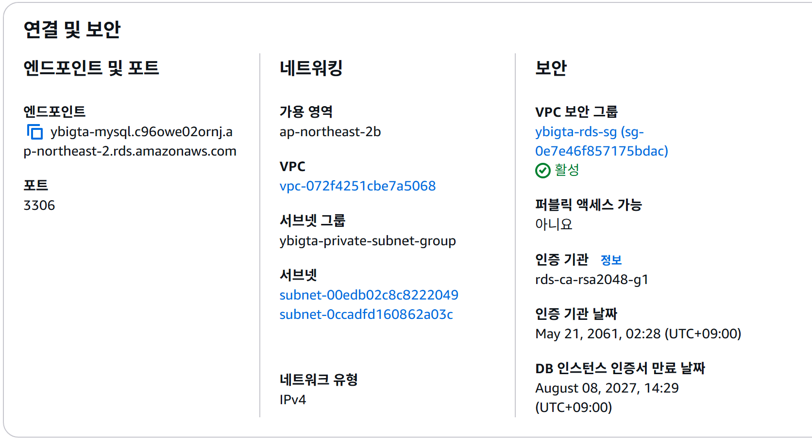
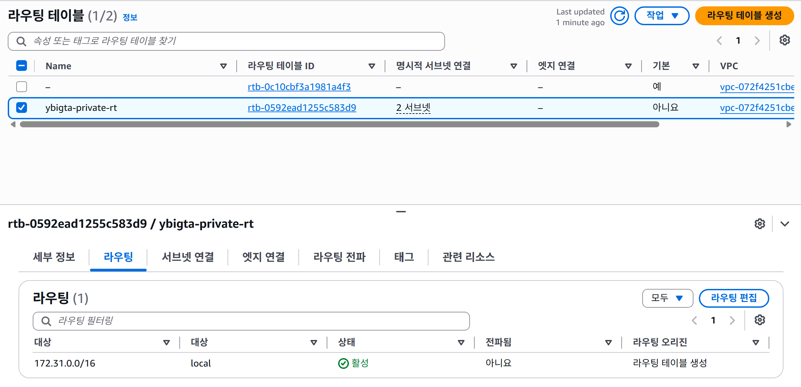
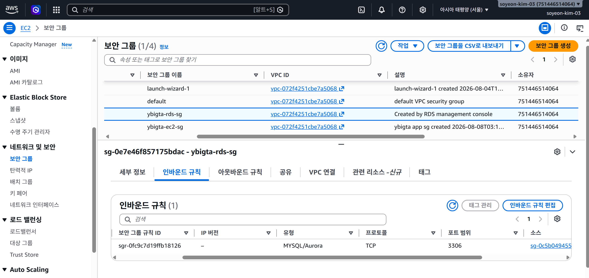

## 트러블슈팅

### RDS 생성 실패 — MySQL 8.0 표준 지원 종료

`mysql-8.0.46 reached RDS end of standard support on Jul 31, 2026` 오류로 생성이 거부되었습니다. AWS는 엔진 버전별로 표준 지원 종료일을 두고, 이후에는 유료인 Extended Support 구독을 요구합니다. 추가 과금을 피하기 위해 표준 지원 기간이 남아 있는 MySQL 8.4로 전환했습니다. pymysql은 8.4에서도 `caching_sha2_password` 인증을 동일하게 지원하므로 애플리케이션 코드 수정은 필요하지 않았습니다.

### 보안 그룹 규칙의 소스 유형 변경 불가

기존 CIDR 기반 인바운드 규칙의 소스를 보안 그룹 참조로 변경하려 하자 `기존 IPv4 CIDR 규칙에 참조된 그룹 ID를 지정할 수 없습니다` 오류가 발생했습니다. AWS는 이미 생성된 규칙의 소스 *유형* 자체를 변경하는 것을 허용하지 않습니다. 규칙을 삭제한 뒤 보안 그룹 참조로 새로 생성하여 해결했습니다.

### DB 서브넷 그룹은 생성 후 변경 불가

프라이빗 서브넷으로 이전하기 위해 기존 인스턴스의 서브넷 그룹을 변경하려 했으나 `You cannot move DB instance to subnet group ... in the same VPC` 오류가 발생했습니다. 서브넷 그룹은 인스턴스의 네트워크 배치를 결정하는 생성 시점 속성에 가까워, 동일 VPC 내 다른 그룹으로는 이동할 수 없습니다. 결국 인스턴스를 삭제하고 프라이빗 서브넷 그룹을 지정하여 재생성했습니다. **네트워크 구성은 리소스를 만들기 전에 먼저 설계해야 한다**는 점을 확인한 사례입니다.

### MongoDB URI에 데이터베이스 이름 누락

`mongodb_connection.py`가 `mongo_client.get_database()`를 인자 없이 호출하는 구조여서, 연결 문자열 경로에 DB 이름이 없으면 기본 DB를 결정하지 못해 `ConfigurationError`가 발생합니다. Atlas가 제공하는 기본 문자열(`.../?retryWrites=...`)에 DB 이름을 명시하여 `.../ybigta?retryWrites=...` 형태로 수정했습니다.

### DB 비밀번호의 특수문자와 URL 파싱

`mysql_connection.py`는 f-string으로 `mysql+pymysql://{user}:{pw}@{host}:{port}/{db}` 형태의 URL을 조립하며 비밀번호를 URL 인코딩하지 않습니다. 비밀번호에 `@`나 `:`가 포함되면 호스트·포트 구분자와 충돌해 파싱이 깨지므로 영문과 숫자로만 구성했습니다. 근본적으로는 `urllib.parse.quote_plus()`로 인코딩하는 것이 안전합니다.

### Docker 그룹 권한의 지연 적용

`usermod -aG docker ec2-user` 실행 후에도 `permission denied while trying to connect to the Docker daemon socket` 오류가 지속되었습니다. 리눅스의 그룹 소속 정보는 로그인 시점에 프로세스에 부여되므로 기존 세션에는 반영되지 않습니다. 재접속 후 정상 동작을 확인했습니다.

### 컨테이너 이미지에서 제외된 CSV

preprocess API 호출 시 `No raw data found in reviews_yes24` 404가 발생했습니다. `.dockerignore`에 `database/*.csv`가 포함되어 크롤링 원본이 이미지에 들어가지 않았기 때문입니다. 이미지 용량 관점에서는 올바른 설정이므로, `docker cp`로 실행 중인 컨테이너에 CSV를 전달한 뒤 적재 스크립트를 실행해 Atlas에 원본 데이터를 넣었습니다. 데이터는 DB에 남고 컨테이너는 언제든 교체 가능하다는 컨테이너 설계 원칙을 확인한 사례입니다.


## 어려웠던 점과 배운 점

### Docker + Git Hub actions

**1. Docker Desktop 엔진이 500 Internal Server Error를 반환하는 문제**

로컬에서 `docker build`를 실행했더니 아래처럼 엔진 자체에 접속이 안 되는 에러가 발생했습니다.

```
ERROR: request returned 500 Internal Server Error for API route and version
http://%2F%2F.%2Fpipe%2FdockerDesktopLinuxEngine/_ping, ...
```

Windows용 Docker Desktop은 `docker` CLI(클라이언트)와 실제 컨테이너를 실행하는 엔진(BuildKit/containerd, WSL2 기반 Linux VM)이 분리되어 있습니다. `docker info`로 확인해보니 `Client` 정보는 정상적으로 뜨는데 `Server` 파트에서만 에러가 나는 걸 보고, CLI는 살아있지만 백엔드(리눅스 VM) 쪽 프로세스만 죽어있는 상태라는 걸 알게 됐습니다. Docker Desktop을 완전히 재시작해서 백엔드 프로세스를 새로 띄우니 해결됐습니다.

> **개념 정리**: Docker Desktop은 macOS/Windows에서 리눅스 커널이 없기 때문에, 실제 컨테이너는 내부적으로 띄운 경량 리눅스 VM(WSL2) 안에서 실행되고, 우리가 치는 `docker` 명령어는 그 VM의 데몬에 API로 요청을 보내는 클라이언트일 뿐입니다. 즉 "docker 명령이 안 먹힌다"는 문제의 상당수는 CLI가 아니라 이 VM/백엔드 프로세스가 죽었거나 응답이 없는 경우이며, `docker info`로 Client/Server 응답을 나눠 보면 어느 쪽이 문제인지 빠르게 좁힐 수 있음을 알게 되었습니다. 

**2. `pip install` 중 대용량 패키지 다운로드 타임아웃**

`requirements.txt`에는 `scipy`, `scikit-learn`, `pandas`, `mypy` 등 용량이 큰(10~35MB) wheel 파일이 포함되어 있는데, 이미지 빌드 중 다음과 같은 에러로 두 차례나 빌드가 실패했습니다.

```
pip._vendor.urllib3.exceptions.ReadTimeoutError: HTTPSConnectionPool(host='files.pythonhosted.org', port=443): Read timed out.
```

네트워크 속도가 느려지는 구간에서 pip의 기본 read timeout(약 15초) 안에 다음 청크가 도착하지 못하면 다운로드 전체가 실패로 처리되는 것이 원인이었습니다. Dockerfile의 `pip install` 명령에 아래처럼 타임아웃과 재시도 횟수를 늘려주는 옵션을 추가해 해결했습니다.

```dockerfile
RUN pip install --no-cache-dir --default-timeout=120 --retries 10 -r requirements.txt
```

> **개념 정리**: pip은 패키지를 내려받을 때 내부적으로 `urllib3` 커넥션 풀을 사용하는데, 기본 read timeout이 짧아서 회선이 불안정한 네트워크 환경에서는 큰 wheel 파일 하나 받다가도 쉽게 실패할 수 있습니다. `--default-timeout`은 응답 대기 한계 시간을, `--retries`는 실패 시 재시도 횟수를 늘려주는 옵션으로, 특히 GitHub Actions처럼 매번 새로운 러너에서 캐시 없이 전체 의존성을 새로 받아야 하는 CI 환경에서는 필수에 가까운 안전장치라는 걸 배웠습니다.

**3. `.env`를 이미지에 올리지 않기 위한 `.dockerignore`**

`docker build`는 기본적으로 `Dockerfile`이 있는 디렉토리(빌드 컨텍스트) 전체를 데몬으로 보낸 뒤 그 안에서 `COPY . .`로 파일을 복사합니다. `.dockerignore`가 없으면 MySQL/MongoDB 접속 정보가 담긴 `.env`, 크롤링 원본 CSV, `.git` 히스토리까지 통째로 이미지 레이어에 박제되어, public으로 올리는 순간 그대로 유출됩니다. `.dockerignore`에 `.env`, `.git`, `test/`, 대용량 CSV 등을 명시해 컨텍스트 전송 단계에서부터 제외되도록 했습니다.

> **개념 정리**: `.gitignore`가 "커밋에서 제외"라면 `.dockerignore`는 "빌드 컨텍스트/이미지에서 제외"입니다. 둘은 별개의 파일이라 `.gitignore`에만 적어두고 안심하면 안 되고, 이미지에 포함되면 안 되는 민감 정보는 반드시 `.dockerignore`에도 따로 등록해야 한다는 걸 이번에 명확히 알게 됐습니다.


### 로드 밸랜서 설정 
이번 과제에서 가장 헤맸던 부분은 로드 밸런서 설정이었습니다. ALB는 트래픽을 받기만 할 뿐 어디로 보낼지는 스스로 알지 못하고, 그 "목적지 서버 명단"을 정의하는 것이 대상 그룹(Target Group) 이라는 점을 이해하는 데 시간이 걸렸습니다. ALB는 80번 포트로 받지만 실제 앱은 8000번에서 돌기 때문에 대상 그룹은 8000을 기준으로 설정해야 했고, 상태 검사 경로도 /로 두면 404가 떠 계속 unhealthy가 되어 /health 엔드포인트를 따로 추가해 해결했습니다.

또한 EC2 보안 그룹에서 기존 0.0.0.0/0 규칙의 소스를 ALB 보안 그룹으로 변경하려 하자 CIDR 관련 오류가 나서, 기존 규칙을 삭제하고 새 규칙으로 추가하여 해결했습니다.


###RDS 보완 설정 
이번 과제에서 가장 어려웠던 부분은 RDS 보안 설정입니다. 퍼블릭 액세스를 '아니요'로만 하면 끝인 줄 알았는데, 그건 퍼블릭 IP를 안 받는다는 의미일 뿐이고 인스턴스가 있는 서브넷 자체는 여전히 인터넷 게이트웨이로 라우팅되는 퍼블릭 서브넷이라는 걸 알게 됐습니다. 기본 VPC의 서브넷 4개가 전부 그 상태여서, IGW 경로 없이 local만 갖는 라우팅 테이블을 따로 만들고 서브넷 2개를 연결해 프라이빗으로 바꿨습니다.

그런데 이미 만들어둔 RDS를 그 프라이빗 서브넷 그룹으로 옮기려 하니 같은 VPC 안에서는 서브넷 그룹을 변경할 수 없다는 에러가 났습니다. 서브넷 그룹은 사실상 생성 시점에 결정되는 속성이라, 결국 인스턴스를 삭제하고 처음부터 프라이빗 서브넷 그룹을 지정해서 다시 만들었습니다. 네트워크 구성은 리소스 만들기 전에 먼저 설계해야 한다는 걸 배웠습니다.

보안 그룹은 EC2용과 RDS용을 분리하고, RDS 인바운드 3306의 소스를 IP 대역이 아니라 EC2 보안 그룹 자체로 참조하게 설정했습니다. 이러면 EC2 IP가 바뀌어도 규칙을 안 고쳐도 되고 접근 주체가 명확해집니다. 저도 여기서 기존 CIDR 규칙의 소스를 그룹 참조로 바꾸려다 같은 에러를 만나서, 규칙 삭제 후 새로 추가해서 해결했습니다.

그 외에 RDS 생성할 때 MySQL 8.0이 표준 지원 종료돼서 8.4로 사용하는 것, MongoDB 연결 문자열에 DB 이름을 빼먹으면 get_database()가 실패한다는 것, 도커 그룹 권한은 재로그인해야 적용된다는 것도 알 수 있었습니다.
